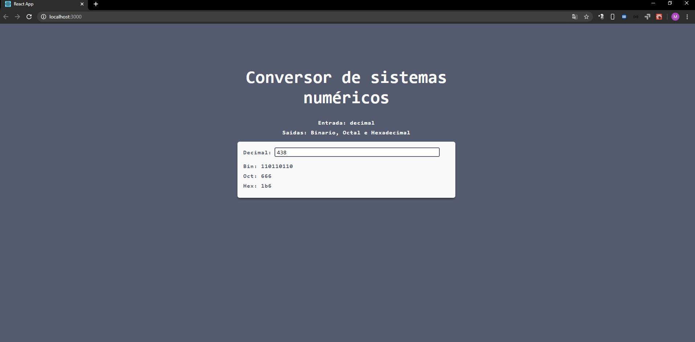

# 📐 Conversor de sistemas numéricos 
 

### Entrada:  
**Decimal**  
### Saidas:   
**Binário, Octal e Hexadecimal**    

-----------------------------------------------------------

-------------------------------------------------------------------------------------------------------

## :wrench: Tecnologias:  

ReactJS  

--------------------------------------------------------------------------------------

## 👷 Instalação

Você precisa instalar o Node.js primeiro, em seguida, para clonar o projeto via HTTPS, execute este comando:

    git clone https://github.com/maiconboer/number-system-converter.git

Abra a pasta do projeto em seu terminal e execute o seguinte comando:

    npm install  

Com as instalações das dependencias finalizadas, podemos dar início a execução do projeto, execute o seguinte comando:

    npm start

🎉 **Pronto! O conversor já estará funcionando no seguinte endereço:**   

    http://localhost:3000  💻

   

